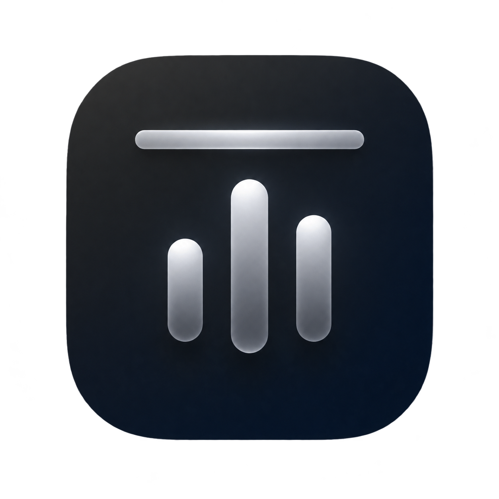

# MacDock

A modular macOS menubar utility — system monitor, clipboard history, screenshots, and more. All-in-one, native, open source.



## Modules

- **Monitor** — live CPU, memory, disk, and network throughput in a compact panel.
- **Clipboard** — persistent searchable history, pinning, paste-as-plain-text.
- **Screenshot** — area/window/fullscreen capture to clipboard or `~/Pictures/MacDock`.

Each module can be toggled on or off in Settings.

## Requirements

- macOS 15+
- Xcode 26+ and [XcodeGen](https://github.com/yonsm/XcodeGen) (`brew install xcodegen`)

## Build & Run

```sh
xcodegen            # generates MacDock.xcodeproj
make build          # or: xcodebuild -scheme MacDock build
make run            # builds and launches the app (menubar only, no Dock icon)
```

## Releases & auto-update

MacDock ships via GitHub Releases with Sparkle auto-update — the app checks
`appcast.xml` (served from this repo) daily and offers updates in place.

To cut a release, tag a commit and push:

```sh
git tag v0.2.0 && git push origin v0.2.0
```

The `release` workflow builds a signed, notarized `MacDock.dmg` (drag-to-
Applications installer) plus a `MacDock.zip` for Sparkle, publishes the
release, and regenerates `appcast.xml` on `main`.

Required repo secrets:

| Secret | What |
| --- | --- |
| `DEVELOPER_ID_P12` | Base64 of the exported signing certificate + private key (.p12) |
| `DEVELOPER_ID_P12_PASSWORD` | Password used when exporting the .p12 |
| `KEYCHAIN_PASSWORD` | Any strong password for the CI keychain |
| `APPLE_TEAM_ID` | 10-char Team ID |
| `NOTARIZATION_API_KEY_P8` | Base64 of the App Store Connect API key (`AuthKey_*.p8`) used by `notarytool` |
| `NOTARIZATION_KEY_ID` | The key's ID (e.g. `77G324T46F`) |
| `NOTARIZATION_ISSUER` | Issuer ID (UUID) from App Store Connect → Integrations |
| `SPARKLE_PRIVATE_KEY` | EdDSA private key matching `SUPublicEDKey` in `Sources/Info.plist` |

## Philosophy

Every change that lands must leave the app in a genuinely usable state — no MVP, no placeholder versions; only better.

## License

MIT
